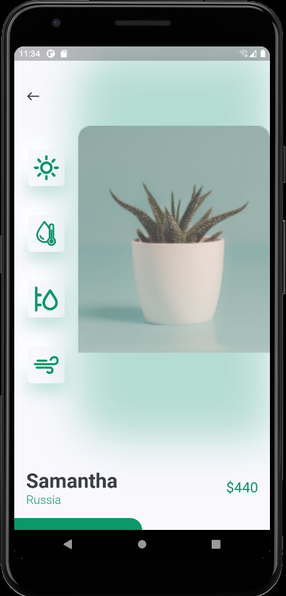

<h1 align="center">
 " Plant App "
</h1>

 

<h1 align="center">
  
  
</h1>

## 💻 Projeto
Aplicação criada a partir do [tutorial](https://www.youtube.com/watch?v=LN668OAUrK4&t=47s), disponível no canal [The Flutter Way](https://www.youtube.com/c/TheFlutterWay). 
O objetivo foi aprender na prática alguns conceitos/widgets básicos presentes no flutter.  

## 🚀 Tecnologia ultilizada

- Aplicação criada com **[Flutter](https://flutter.dev/)**.